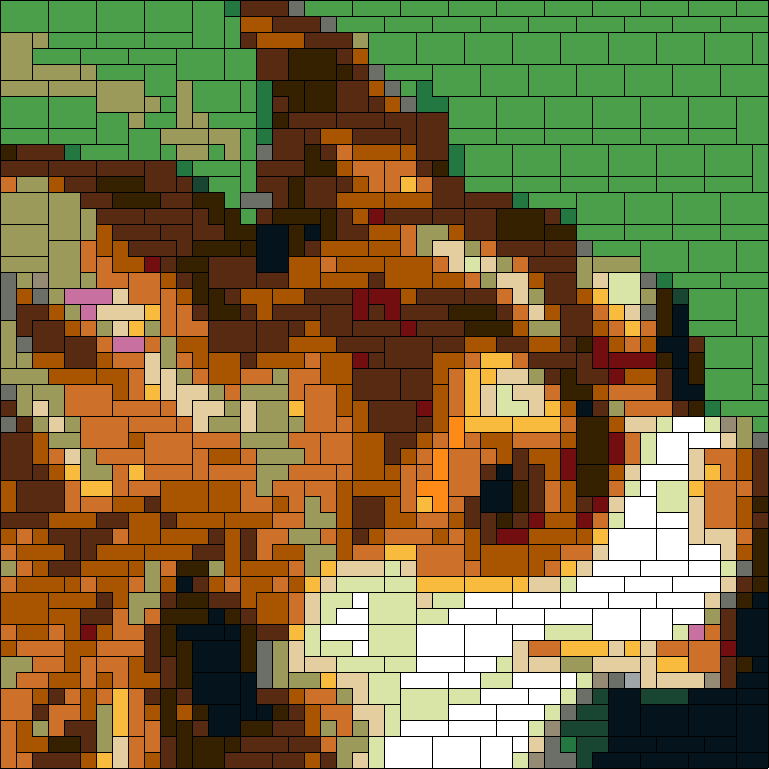

## LegoArtist
A simple app that lets you turn images into LEGO mosaics.

## Example



## Quick Start
Follow these steps to run LegoArtist:
```
# Clone LegoArtist
$ git clone https://github.com/mattstraehl/LegoArtist.git

# Change directory to LegoArtist
$ cd LegoArtist

# Run sbt
$ sbt

# Run LegoArtist
> run
```

