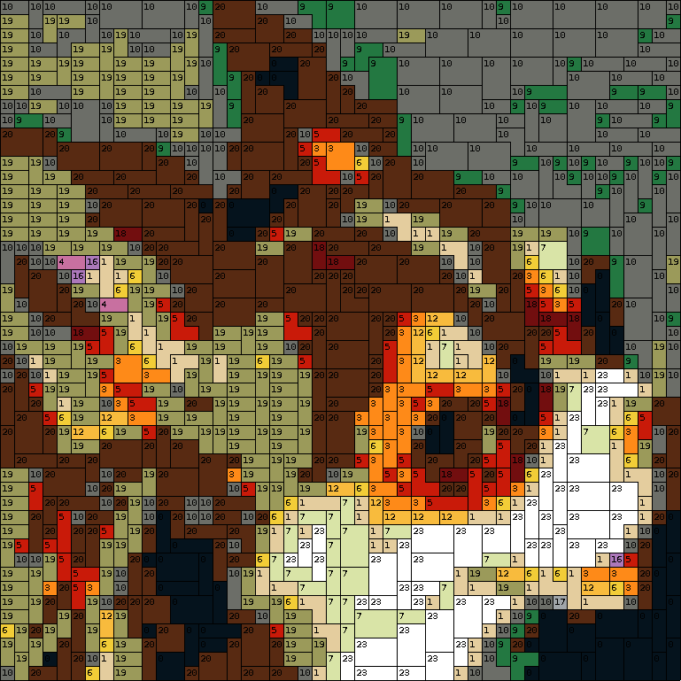
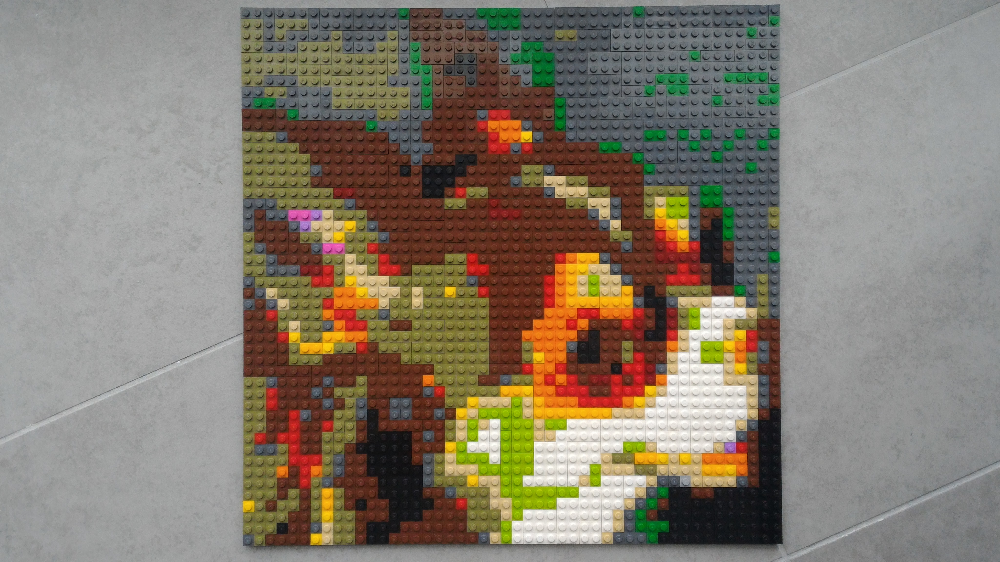

## LegoArtist
A simple app that lets you turn images into LEGO mosaics. It generates a build manual and lists the required number of pieces.

## Example






```
List(B1x1)
	BLACK: 8
	BRICK_YELLOW: 42
	BRIGHT_ORANGE: 21
	BRIGHT_RED: 31
	BRIGHT_YELLOW: 29
	DARK_GREEN: 26
	DARK_STONE_GREY: 107
	MEDIUM_LAVENDEL: 3
	MEDIUM_STONE_GREY: 1
	REDDISH_BROWN: 51
	WHITE: 3

List(B2x2)
	BLACK: 2
	BRIGHT_ORANGE: 2
	BRIGHT_YELLOWISH_GREEN: 3
	DARK_GREEN: 2
	DARK_STONE_GREY: 4
	REDDISH_BROWN: 12
	WHITE: 4

List(B1x2, B2x1)
	BLACK: 8
	BRICK_YELLOW: 14
	BRIGHT_ORANGE: 18
	BRIGHT_PURPLE: 2
	BRIGHT_RED: 12
	BRIGHT_YELLOWISH_GREEN: 19
	DARK_GREEN: 10
	DARK_STONE_GREY: 33
	FLAME_YELLOWISH_ORANGE: 16
	NEW_DARK_RED: 11
	OLIVE_GREEN: 196
	REDDISH_BROWN: 51
	WHITE: 15

List(B1x3, B3x1)
	BLACK: 19
	BRICK_YELLOW: 5
	BRIGHT_RED: 4
	DARK_GREEN: 4
	DARK_STONE_GREY: 35
	REDDISH_BROWN: 53
	WHITE: 11

List(B2x3, B3x2)
	BLACK: 8
	BRIGHT_YELLOWISH_GREEN: 2
	DARK_GREEN: 1
	DARK_STONE_GREY: 30
	REDDISH_BROWN: 39
	WHITE: 11

List(C1, C2, C3)
	BLACK: 3
	BRICK_YELLOW: 9
	BRIGHT_RED: 5
	DARK_GREEN: 3
	DARK_STONE_GREY: 7
	REDDISH_BROWN: 10
	WHITE: 2

Total number of pieces: 1017
```

## Quick Start
Follow these steps to run LegoArtist:
```
# Clone LegoArtist
$ git clone https://github.com/mattstraehl/LegoArtist.git

# Change directory to LegoArtist
$ cd LegoArtist

# Run sbt
$ sbt

# Run LegoArtist
> run
```

